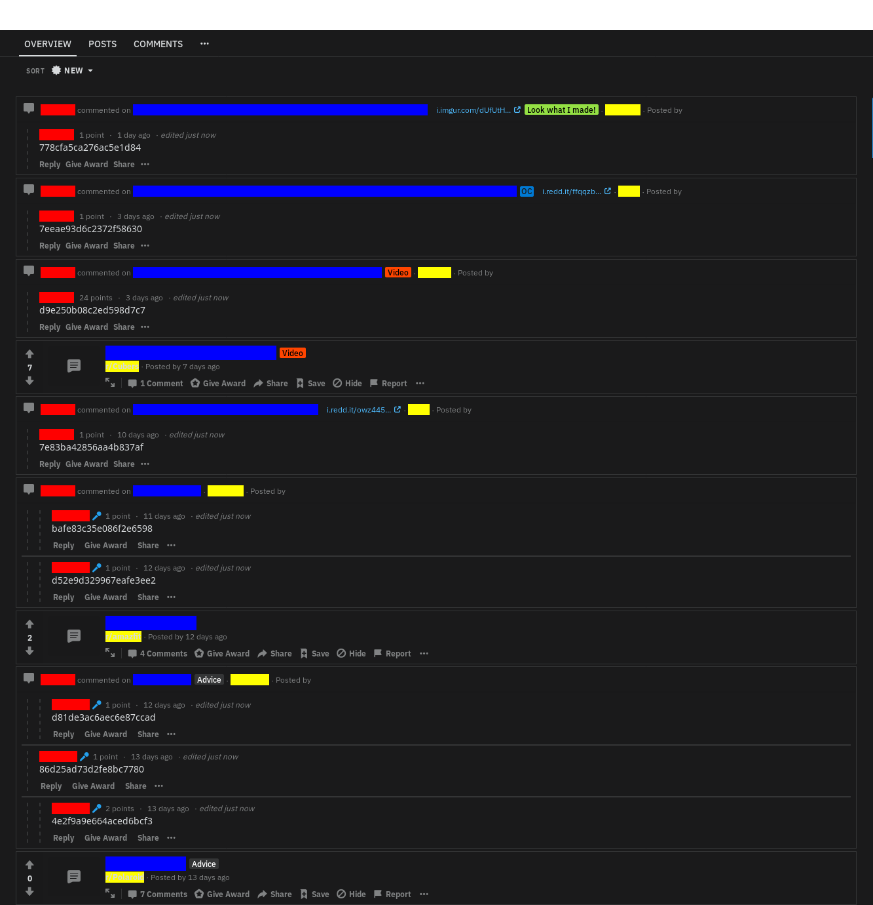

<h1>Backup or Clean Reddit Account</h1>

<h3>Info:</h3>
<p>
	<strong>[Backup]</strong>: With this functionality you can export all your subreddits. Sometimes you need a new account but want to keep all the subs you follow. Most of the time this is a boring job. 
</p>

<p>
	<strong>[Clean]</strong>: With this functionality you can remove all your activity for example delete all the comments you have done or all the posts you have created. People tell personal information that can lead to someone that knows them or recognize them. Lot of people say or posts things in Reddit that in person no one knows. (Actions can't be undone)
</p>

<p>
	<strong>[Confuse]</strong>: Replace your comments and posts text (not 
title). This is helpful since deleted comments can still be viewed. 
Results look like screenshot at the end of page. Actions can't be undone in 
most cases unless Rollback functionality is activated with while confusing.
</p>

<p>
	<strong>[Rollback]</strong>: If you changed your mind and you want to
return back the confused items to their original state, rollback can do 
this. <br>

<i>Disclaimer: Rollback still can fail due to varius reasons like removed
item, locked account etc.</i>

</p>

<hr>

<h3>Installation:</h3>

```shell
git clone https://github.com/tsaklidis/subreddits.git
cd subreddits
pip install -r requirements.txt
```

<h3>Prepare:</h3>

<p>

First you need to set the praw.ini file. <br>

<ul>
<li>
	Rename the <strong>praw.ini.example</strong> to <strong>praw.ini</strong> after that create a Reddit app. In order to ask the Reddit for data you need an app so use the following link: <a href="https://www.reddit.com/prefs/apps/">https://www.reddit.com/prefs/apps/</a> 
</li>

<li>
Fill a name for the app. The type should be set to script and redirect uri http://localhost:8080 The script will be working locally, no worries for the uri. 
</li>

<li>
	After creating the app we need the credentials. <strong>client_id</strong> is right under the app name and <strong>client_secret</strong> is the secret key. 
</li>

<li>
Get credentials for old and new accounts. 
</li>

<li>
Fill the data in praw.ini file
</li>
</ul>

<hr>
<h3>Export subreddits from your old account</h3>

```shell
python3 src/main.py -e
```

<h3>
	Import to your new account
</h3>

```shell
python3 src/main.py -r
```

<h3>
	Export and Import with one run
</h3>

```shell
python3 src/main.py -o
```

<hr>

<h3>Confuse all your activity</h3>
<p>You will be guided through questions what you want to confuse. <br>
Comments or submissions 
(posts), bulk or single action
</p>

```shell
python3 src/cleaner.py -c
```

<p>Use <code>-rlb</code> option in case you would like use the Rollback 
feature and restore the confused items</p>

```shell
python3 src/cleaner.py -c -rlb
```

<hr>
<h3>Rollback the confused items</h3>
<p>If you changed your mind and you want back your original 
comments/submissions you can use the rollback feature.

The rollback is available only if you confused <strong>WITH</strong>
-rlb option.</p>

```shell
python3 src/rollback.py
```

<h3>
	<strong>Delete</strong> all your activity.
</h3>
<p>You will be asked for comments or submissions (posts)</p>

```shell
python3 src/cleaner.py -d
```

After using the confuser, the results are similar to the screen.



<h3>Changelog:</h3>
<p>Changes can be found in the [changelog file](changelog.md)</p>